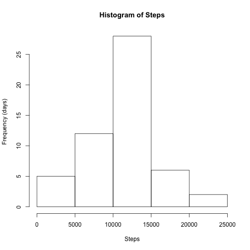
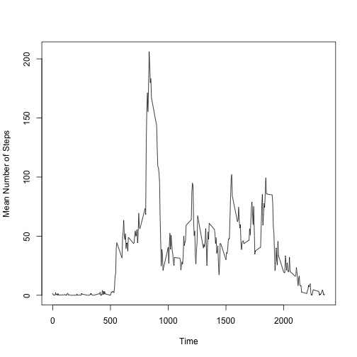
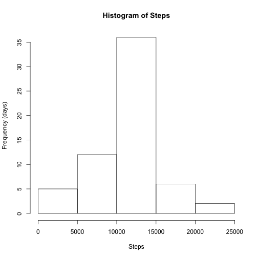
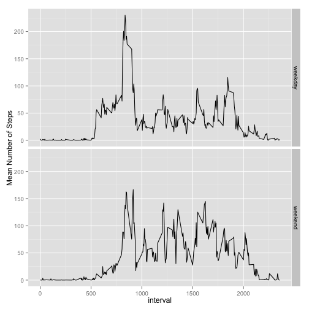

Reproducible Research - Course Project 1
========================================

- First, set the working directory and load the data.

```r
setwd("~/Desktop/Coursera/05_Reproducible/CourseProject1/RepData_PeerAssessment1")
maindata <- read.csv("activity.csv")
head(maindata)
```

```
##   steps       date interval
## 1    NA 2012-10-01        0
## 2    NA 2012-10-01        5
## 3    NA 2012-10-01       10
## 4    NA 2012-10-01       15
## 5    NA 2012-10-01       20
## 6    NA 2012-10-01       25
```

###What is the mean total number of steps taken per day?###

**1. Calculate the total number of steps taken per day.**


```r
summarybydate <- aggregate(steps~date, sum, data = maindata)
head(summarybydate)
```

```
##         date steps
## 1 2012-10-02   126
## 2 2012-10-03 11352
## 3 2012-10-04 12116
## 4 2012-10-05 13294
## 5 2012-10-06 15420
## 6 2012-10-07 11015
```

**2. Make a histogram of the total number of steps taken each day.**


```r
hist(summarybydate$steps, xlab = "Steps", ylab = "Frequency (days)", main = "Histogram of Steps")
```

 

**3. Calculate and report the mean and median of the total number of steps taken each day.**


```r
mean(summarybydate$steps)
```

```
## [1] 10766.19
```

```r
median(summarybydate$steps)
```

```
## [1] 10765
```

###What is the average daily activity pattern?###

**1. Make a time series plot (i.e. type = "l") of the 5-minute interval (x-axis) and the average number of steps taken, averaged across all days (y-axis).**


```r
summarybytime <- aggregate(steps~interval, mean, data = maindata)
plot(summarybytime$steps~summarybytime$interval, type = "l", xlab = "Time", ylab = "Mean Number of Steps")
```

 

**2. Which 5-minute interval, on average across all the days in the dataset, contains the maximum number of steps?**


```r
summarybytime[which.max(summarybytime[,2]),1]
```

```
## [1] 835
```

###Imputing Missing Values###

**1. Calculate and report the total number of missing values in the dataset (i.e. the total number of rows with NAs).**


```r
length(which(is.na(maindata$steps)))
```

```
## [1] 2304
```

**2. Devise a strategy for filling in all of the missing values in the dataset. The strategy does not need to be sophisticated. For example, you could use the mean/median for that day, or the mean for that 5-minute interval, etc.**

- This portion requires no coding, just a game plan. I plan on using the suggested method of filling in NAs for a given interval with the mean number of steps for that 5-minute interval across all days, since I've already calculated those means for the previous section of the project.

**3. Create a new dataset that is equal to the original dataset but with the missing data filled in.**

- In order to do the replacing, I will merge the maindata data set with the summarybytime data set on the interval field.


```r
fixed_maindata <- merge(x = maindata, y = summarybytime, by = "interval", all.x = TRUE)

head(fixed_maindata)
```

```
##   interval steps.x       date  steps.y
## 1        0      NA 2012-10-01 1.716981
## 2        0       0 2012-11-23 1.716981
## 3        0       0 2012-10-28 1.716981
## 4        0       0 2012-11-06 1.716981
## 5        0       0 2012-11-24 1.716981
## 6        0       0 2012-11-15 1.716981
```

-  Then, in the steps coulmn, if there is an NA replace it with the mean number of steps for that interval that was just merged, using a loop.


```r
for(i in 1:nrow(fixed_maindata)){
    if(is.na(fixed_maindata[i,2])){
        fixed_maindata[i,2] <- fixed_maindata[i,4]
    }
}

fixed_maindata$steps.y <- NULL
head(fixed_maindata)
```

```
##   interval  steps.x       date
## 1        0 1.716981 2012-10-01
## 2        0 0.000000 2012-11-23
## 3        0 0.000000 2012-10-28
## 4        0 0.000000 2012-11-06
## 5        0 0.000000 2012-11-24
## 6        0 0.000000 2012-11-15
```

**4. Make a histogram of the total number of steps taken each day and Calculate and report the mean and median total number of steps taken per day. Do these values differ from the estimates from the first part of the assignment? What is the impact of imputing missing data on the estimates of the total daily number of steps?**

- First the histogram.


```r
final_summarybydate <- aggregate(steps.x~date, sum, data = fixed_maindata)
hist(final_summarybydate$steps.x, xlab = "Steps", ylab = "Frequency (days)", main = "Histogram of Steps")
```

 

- Then the mean and median.


```r
mean(final_summarybydate$steps.x)
```

```
## [1] 10766.19
```

```r
median(final_summarybydate$steps.x)
```

```
## [1] 10766.19
```

- The imputed values seem to have had very little effect on the outcome.

###Are there differences in activity patterns between weekdays and weekends?###

**1) Create a new factor variable in the dataset with two levels – “weekday” and “weekend” indicating whether a given date is a weekday or weekend day.**


```r
fixed_maindata$date <- as.Date(fixed_maindata$date)
fixed_maindata$daytype <- weekdays(fixed_maindata$date)

for(i in 1:nrow(fixed_maindata)){
    if(fixed_maindata[i,4] == "Saturday" | fixed_maindata[i,4] == "Sunday"){
        fixed_maindata[i,4] <- "weekend"
    }else{
        fixed_maindata[i,4] <- "weekday"
    }
}

head(fixed_maindata)
```

```
##   interval  steps.x       date daytype
## 1        0 1.716981 2012-10-01 weekday
## 2        0 0.000000 2012-11-23 weekday
## 3        0 0.000000 2012-10-28 weekend
## 4        0 0.000000 2012-11-06 weekday
## 5        0 0.000000 2012-11-24 weekend
## 6        0 0.000000 2012-11-15 weekday
```

**2) Make a panel plot containing a time series plot (i.e. type = "l") of the 5-minute interval (x-axis) and the average number of steps taken, averaged across all weekday days or weekend days (y-axis).**


```r
library(ggplot2)
```

```
## Warning: package 'ggplot2' was built under R version 3.1.2
```

```r
summarybydaytype <- aggregate(steps.x~interval+daytype, mean, data = fixed_maindata)

qplot(interval, steps.x, data = summarybydaytype, geom = "line", facets = daytype~.) + ylab("Mean Number of Steps")
```

 
